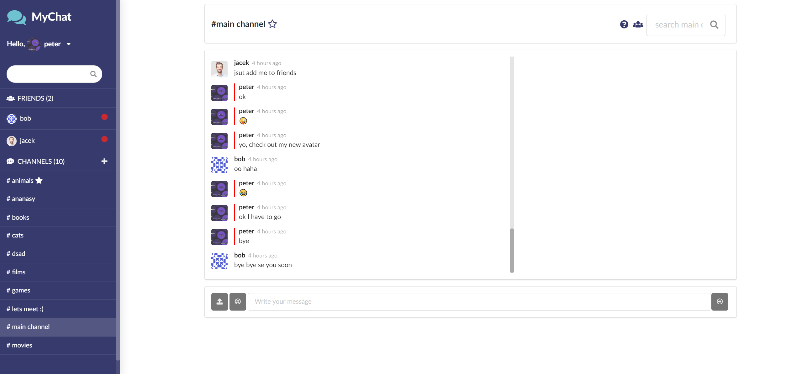
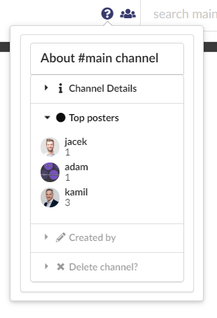
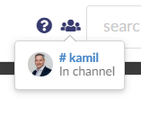

# My Chatting App
> My Chatting App is a web application that allows you chat with friends on private channels or strangers in public rooms that you can join or create.



  My Chatting App is a chatting application that allows you to add and message your friends and create public rooms to chat with strangers.
  Application was created with React (React Hooks, React Router, Redux) as a front-end and Google Firebase as back-end. All with use of Semanti UI to style the website.
  

## Installation

> install all packages

```sh
npm install
```

> start the app

```sh
npm start
```

> how to start tests

```sh
npm test start
```


## Usage example

Start by creating an account and logging in the application. 


If you are logging for the first time you should see an intro describing main parts of the app.
After completing it you can see the main view of the application.


In the to left corner you can open your user panel by clicking on your name. 


By default you have a randomly generated avatar that you can change by clicking "Chane Avatar" button.


Here you can crop and upload and image that will be your own avatar. After uploading and cropping click "Change avatar" button on top.

Next in the user panel you can enable dark mode that will change colors of the website to much darker.


You can also replay tutorial/intro and sign out.


Below the user panel you have search bar where you can search for users and channels by their name.


After searching for a user, you can add him by clicking on the green + icon on the top. He will appear in your friend list on the left.


User that you just added to friends just got an invitation. 


Now you can chat with our friend and check for his status if he is online or offline.

The last section of sidebar are public channels. Here you can see a list of all public chat rooms that users have created.


Clicking plus icon creates new public channel where users can join and talk without limits.


Channel should appear on the left in the channels section.


Next up on the top we have channel header section, where as you already know you can add your friend or add channel to favourite by clicking empty star icon. 
Starred channel will automaticaly go up top of all channels in channel sidebar.


In the right side of header there is:
- channel details which contains: channel description, top posters, who created that channel, possibility to delete channel if you are the owner,
- list of all user that are currently in the channel (you can click on the user to add him to friends and start private conversation,
- channel search bar where you can search by username or by a message,






In the middle there is messages section where you can see all the current channel messages.


And lastly in the bottom section you have possibility to write messages, add emotes and upload pictures into the conversation.


Real time usage example


## Contact

Your Name – Jacek Pluta

Email - j.pluta123@gmail.com

Website - https://jacekplutaportfolio.netlify.app/


## License

- Copyright 2020 © <a href="https://jacekplutaportfolio.netlify.app/" target="_blank">Jacek Pluta</a>.
