# My Chatting App

My Chatting App is a web application that allows you to chat with your friends or with stragers in public channels that you can join or create.

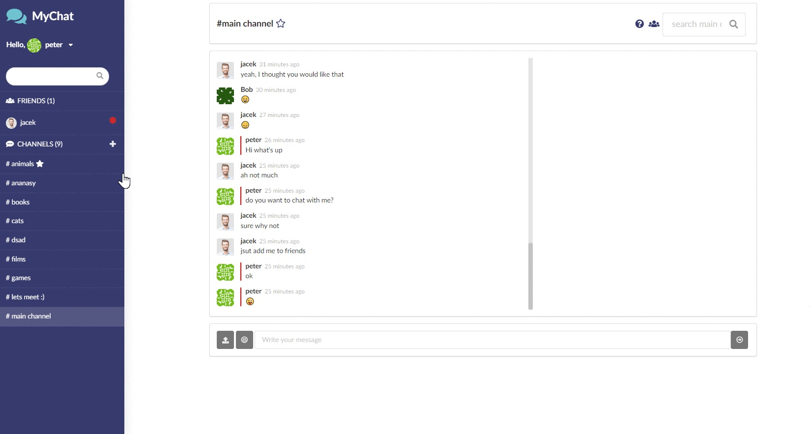

App allows to add and message other users, create your own chat rooms, upload pictures and emojis to conversations,
change avatar, add channels to favourites, search other users and chatrooms by name and much more.

Chat was created with React (React Hooks, React Router, Redux) as a front-end and Google Firebase as back-end.
All with use of Semanti UI and CSS to style the website.

## Installation

install all packages

```
npm install
```

start the app

```
npm start
```

how to start tests

```
npm test start
```

## Usage example

1. Start by creating an account and logging in the application.  
   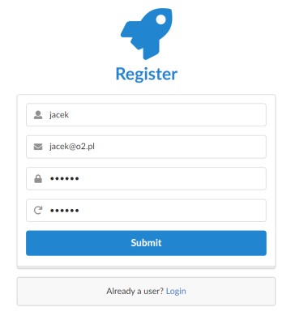

2. If you are logging for the first time you will have to go through an intro describing main parts of the app.

3. After completing it you should see of main view of the application.  
   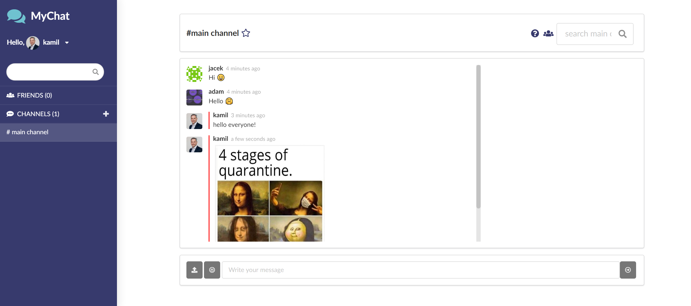

4. In the top left corner you can open your user panel by clicking on your name.  
   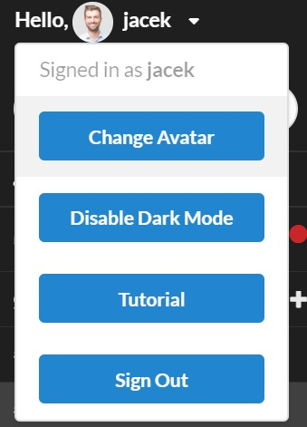

5. By default you have a randomly generated avatar that you can change by uploading a new one and clicking "Change Avatar" button.  
   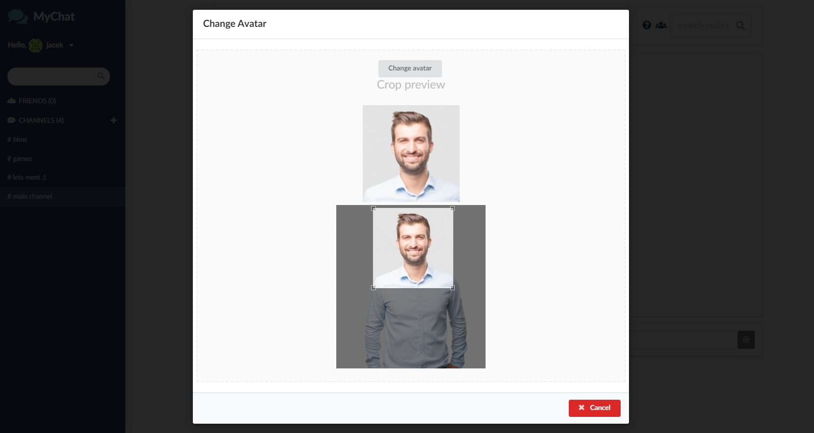

6. Next in the user panel is an option to enable dark mode that will change colors of the website to much darker ones.  
   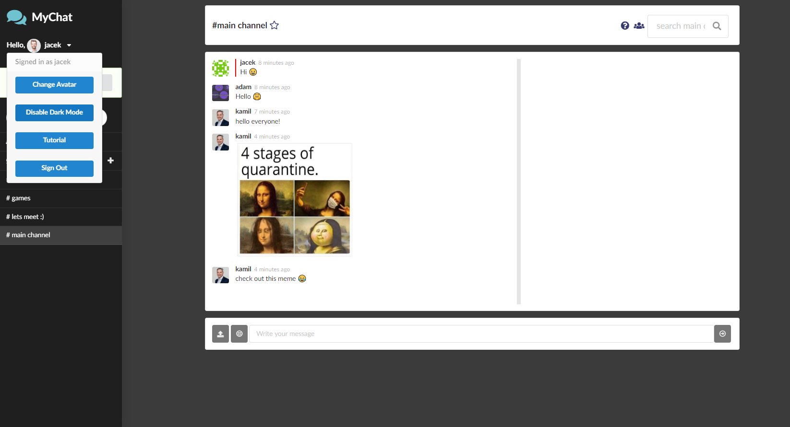

7. Last options are to replay tutorial/intro and sign out of the account.  
   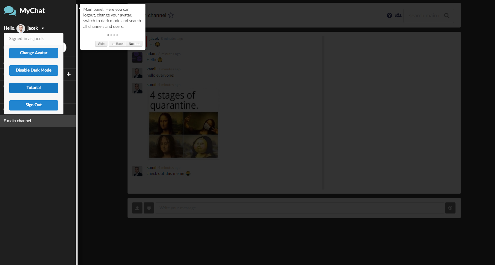

8. Below the user panel is a search bar where you can search for users and channels by their name.  
   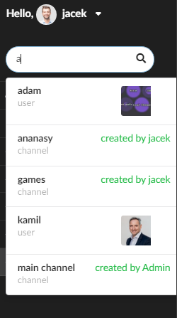

9. After searching for a user, you can add him by clicking on the green "+" icon on the top. New friend should appear in your friend list on the left.  
   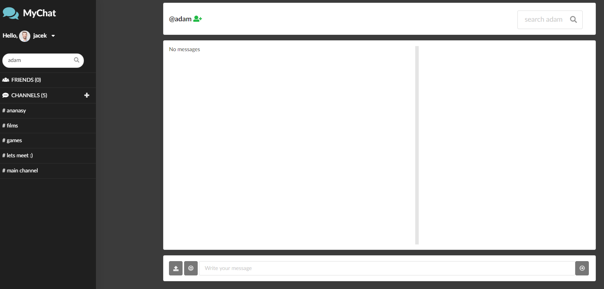

10. User that you added to friends just got an invitation.  
    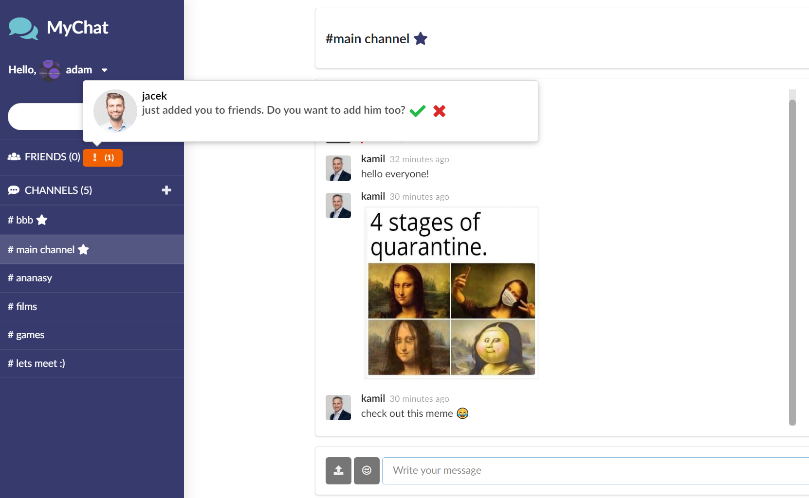

11. If he accepts you invite, you can chat with him and check for his status if he is online or offline.  
    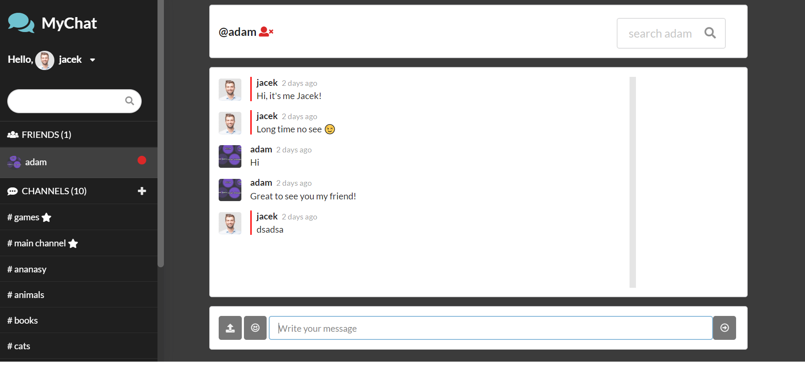

12. The last section of sidebar are public channels. Here you can see a list of all public chat rooms that other users have created.  
    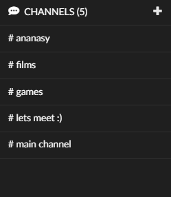

13. Clicking plus icon creates new public channel where users can join and talk without limits.  
    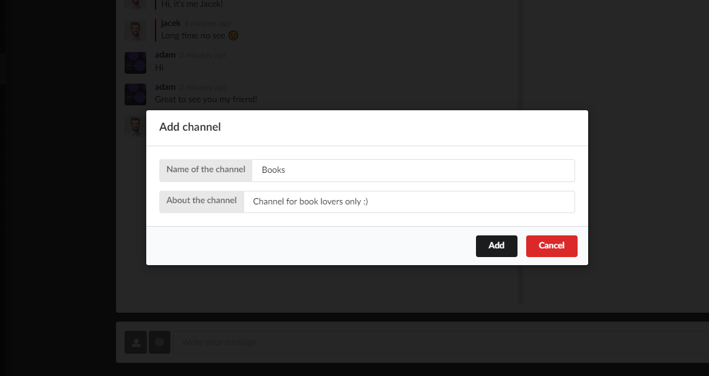

14. Created channel should appear on the left in the channels section.  
    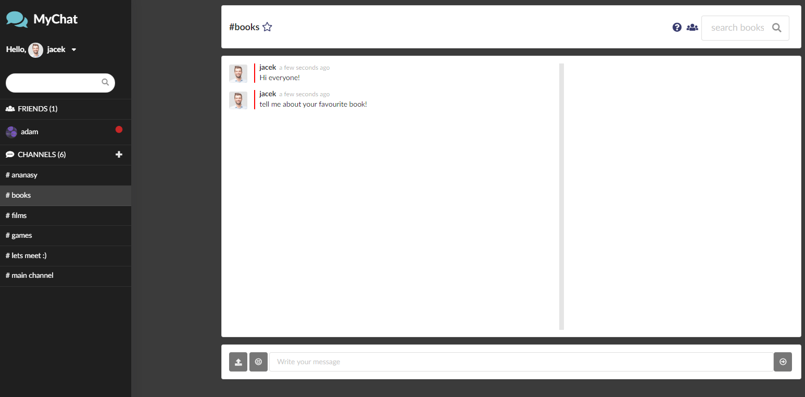

15. Next, on the top, there is channel header, where as you already know you can add your friend or add channel to favourites by clicking empty star icon.
    Starred channel will automaticaly go up top of all channels in channel sidebar.  
    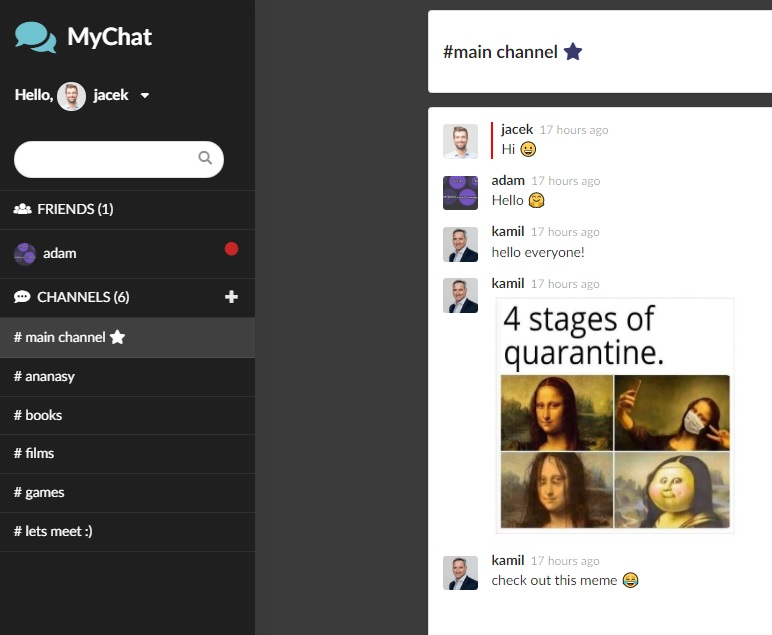

16. In the right side of header there is:

- channel details section which contains: channel description, top posters, who created that channel, possibility to delete channel if you are the owner,
- list of all users that are currently in the channel,
- channel search bar where you can search by username or by a message.


177.  In the middle there is messages section where you can see all the current channel messages.

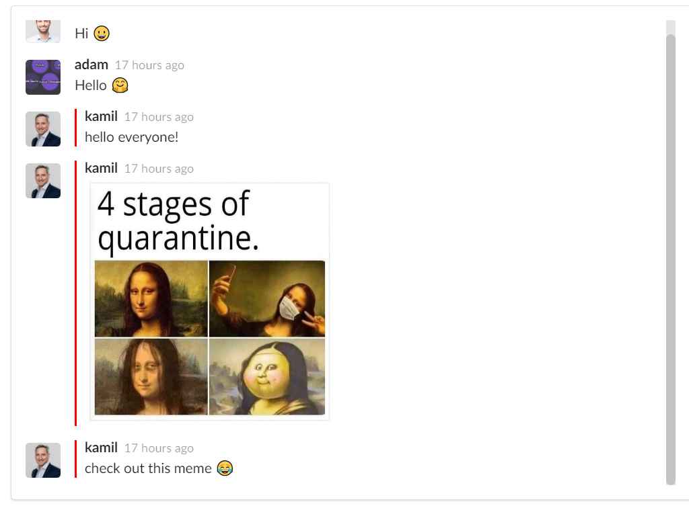

188.  And lastly in the bottom section you have possibility to write messages, add emotes and upload pictures into the conversation.

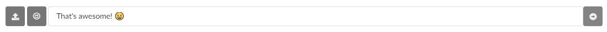

## Contact

Your Name: Jacek Pluta

Email: j.pluta123@gmail.com

Website: https://jacekplutaportfolio.netlify.app/

## License

Copyright 2020 © Jacek Pluta
